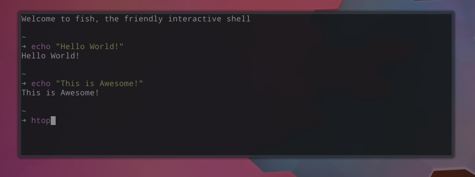

# Termoid

Terminal in a plasmoid.  
Run your favourite shell or terminal applications like nethogs, htop, colortail etc. on your desktop as a widget/plasmoid.

[View on KDE Store](https://store.kde.org/p/1169451/)

# Features
* Terminal :)
* Working keyboard and mouse input
* Comes with many inbuilt color schemes 
* Configurable Font family and Font size in terminal
* Configurable Opacity 

# Screenshots



# Requirements
`qmltermwidget` package is required as this is the core of the plasmoid.
Note: Latest `qmltermwidget` is causing Plasma to crash. 
Please use the [0.1.0 release](https://github.com/Swordfish90/qmltermwidget/tree/v0.1.0) or [Commit 08958f7](https://github.com/Swordfish90/qmltermwidget/commit/08958f7c83a7d05627f623b8904f3e79a0b7366b) which is known to work.

## Source

[Github Source](https://github.com/Swordfish90/qmltermwidget)  

Build step: `qmake && make`

## Arch Distros 

[`qmltermwidget` Package](https://www.archlinux.org/packages/community/x86_64/qmltermwidget/)  

Install version 0.1.0 using 
```
sudo pacman -U https://archive.archlinux.org/packages/q/qmltermwidget/qmltermwidget-0.1.0-3-x86_64.pkg.tar.xz
```

## Ubuntu 

You would need to add a PPA to install "cool-retro-term".
Steps:
For Ubuntu 18.04, 18.10, 19.04, Linux Mint 19 and higher, use this PPA:

sudo add-apt-repository ppa:vantuz/cool-retro-term
sudo apt update
sudo apt install cool-retro-term

For Ubuntu 16.04 and Linux Mint 18 series, use this PPA:

sudo add-apt-repository ppa:noobslab/apps
sudo apt update
sudo apt-get install cool-retro-term

## Fedora
[`qmltermwidget 0.1.0`](https://koji.fedoraproject.org/koji/buildinfo?buildID=1129411)

# Installation

## Install via KDE

    Right Click Panel > Panel Options > Add Widgets
    Get New Widgets > Download New Widgets
    Search: Termoid
    Install
    Right Click your desktop > Add Widgets
    Select Termoid


## KDE Store
[Store link](https://store.kde.org/p/1169451/)

## Build it Yourself
* [Download the source](https://github.com/koldbyte/termoid/archive/master.zip)

```
git clone https://github.com/koldbyte/termoid.git termoid
cd termoid
sh ./install
```

Note:  
* `./install`      (for first time)
* `./reinstall`    (for updating the plasmoid)

Add the Termoid widget from "Add widgets" on your desktop

* The `build`/`run` commands require `kreadconfig5`.
* Do *not* run the `install`/`reinstall` scripts with `sudo` or the plasmoid will be placed in `/usr/share/` instead of your home directory.

## Locations

* `/usr/share/plasma/plasmoids/`  
  Where KDE's default plasmoids are stored.
* `~/.local/share/plasma/plasmoids/`  
  Where downloaded plasmoids are stored. It's also where this plasmoid will be installed to.

# Using Nethogs in Termoid
Install package `nethogs`  
Run `sudo setcap "cap_net_admin,cap_net_raw+pe" /usr/bin/nethogs` once on the system so that sudo permission is not required for running nethogs.

# TODOs
* Try packaging qmltermwidget within the plasmoid with a Cmake build. This should fix all the version issues.
* Provide packages for major distros.
* Support for button form in panel.
* More configuration. (Suggestions are welcome)
* ~Restart plasmoid command without restarting whole plasmashell.~ Use a shell. Keyboard input (along with Ctrl+C) works.
* ~Support for Keyboard input.~ Done
* ~Make sudo commands runnable.~ Sudo commands working now as the keyboard input is available.

# Want to learn more about Plasmoids
## ExampleRepositories

Note that official KDE software is only mirrored on github, however github is much better for navigating the codebase.

* https://github.com/KDE/plasma-desktop/tree/master/applets
* https://github.com/KDE/plasma-workspace/blob/master/applets
* https://github.com/KDE/kdeplasma-addons/tree/master/applets
* https://github.com/KDE/plasma-pa/tree/master/applet
* https://github.com/KDE/plasma-nm/tree/master/applet
* https://github.com/KDE/discover/tree/master/notifier
* https://github.com/kotelnik/plasma-applet-weather-widget
* https://github.com/kotelnik/plasma-applet-redshift-control
* https://github.com/psifidotos/nowdock-plasmoid
* https://github.com/psifidotos/nowdock-panel
* https://github.com/dfaust/plasma-applet-netspeed-widget
* https://github.com/dfaust/plasma-applet-popup-launcher
* https://github.com/dfaust/plasma-applet-places-widget


## Documentation

* Plasma API Tutorials
	* Getting Started  
		https://techbase.kde.org/Development/Tutorials/Plasma5/QML2/GettingStarted
	* API Reference / Overview  
		https://techbase.kde.org/Development/Tutorials/Plasma2/QML2/API
* [QML documentation](http://doc.qt.io/qt-5/qtqml-syntax-basics.html)
* plasma-framework (PlasmaCore, PlasmaComponents, etc) API Documentation  
	https://api.kde.org/frameworks/plasma-framework/html/index.html
	* Source Code  
		https://github.com/KDE/plasma-framework/tree/master/src/declarativeimports/
* [plasmapkg2 source code](https://github.com/KDE/plasma-framework/blob/master/src/plasmapkg/plasmapkg.cpp)
